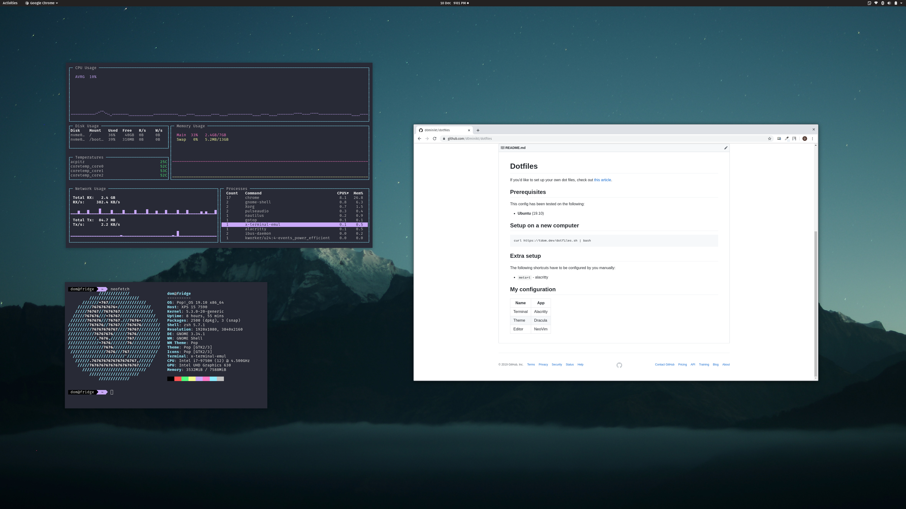

# Dotfiles

If you'd like to set up your own dot files, check out [this article](https://medium.com/toutsbrasil/how-to-manage-your-dotfiles-with-git-f7aeed8adf8b).



## Prerequisites

This config has been tested on the following:
 * **Ubuntu** (19.10)

## Setup on a new computer

```
curl https://tdom.dev/dotfiles.sh | bash
```

## Post Installation

The following shortcuts have to be configured by you manually:
 - `meta+t` - alacritty

NeoVim also requires you to install the plugins yourself:

```
:PlugInstall
:call coc#util#install()
```


## My configuration

| Name        | App                             |
|-------------|---------------------------------|
| Terminal    | Alacritty                       |
| Theme       | Dracula                         |
| Editors     | NeoVim, VsCode                  |
| Languages   | Python, Node.js, Rust, Dart, Go |
| Note Taking | TexLive, Pandoc                 |


### Vim

| Problem         | Solution                                                                                                       |
|-----------------|----------------------------------------------------------------------------------------------------------------|
| Language Server | [coc.nvim](https://github.com/neoclide/coc.nvim)                                                               |
| Snippets        | [UltiSnips](https://github.com/SirVer/ultisnips)                                                               |
| Fuzzy Finder    | [FZF](https://github.com/junegunn/fzf)                                                                         |
| File Viewer     | [NerdTree](https://github.com/scrooloose/nerdtree)                                                             |
| Status Bar      | [Airline](https://github.com/vim-airline/vim-airline)                                                          |
| Themes          | [Dracula](https://github.com/dracula/dracula-theme), [Github](https://github.com/cormacrelf/vim-colors-github) |

#### Key bindings

| Plugin          | Key            | Description                              |
|-----------------|----------------|------------------------------------------|
| General         | `;`            | leader                                   |
|                 | `;;`, `Esc`    | exit insert mode, also works in terminal |
|                 | `<A-hjkl>`     | move between split panels                |
|                 | `<C-n>`        | new terminal                             |
| Language Server | `<C-space>`    | force completion                         |
|                 | `[g`, `[g`     | navigate diagnostics                     |
|                 | `K`            | show documentation                       |
|                 | `gd`           | go to definition                         |
|                 | `gi`           | go to implementation                     |
|                 | `gy`           | go to type definition                    |
|                 | `gr`           | go to references                         |
|                 | `;rn`          | rename symbol                            |
|                 | `;ac`          | show code actions for line               |
|                 | `;qf`          | quick fix line                           |
|                 | `:Format`      | format document                          |
|                 | `:Fold`        | fold selection                           |
| File Viewer     | `<C-b>`        | toggle file viewer                       |
| Fuzzy Finder    | `<C-f>`        | open fuzzy finder                        |
|                 | `<C-t>`        | open file in new tab                     |
|                 | `<C-i>`        | open file in horizontal split            |
|                 | `<C-v>`        | open file in vertical split              |
| Note Taking     | `;ll`          | start compiling `.tex` file on change    |
|                 | `<F6>`         | compile `.md` file                       |
|                 | `<F5>`         | open `.pdf` file generated with Pandoc   |
|                 | `:TableFormat` | format `.md` tables                      |
